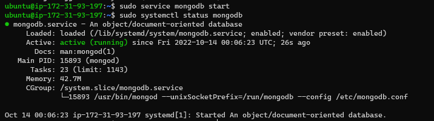

## **PROJECT 4**

### **STEP 0: Preparing Prerequisites**

n project 3, The task is to implement a web solution based on MERN stack in AWS Cloud which consists of following components;

1. MongoDB
2. EpressJs
3. AngularJs
4. Node.js

On the AWS account, create a new EC2 Instance of t2.micro family with Ubuntu Server 20.04 LTS (HVM) image. When you create your EC2 Instances, you can add Tag "Name" to it with a value that corresponds to a current project you are working on – it will be reflected in the name of the EC2 Instance.

Task :
To deploy a Web Book Register Application that.

### **STEP 1: Installing Node.js**

`sudo apt update`

`sudo apt upgrade`

`sudo apt -y install curl dirmngr apt-transport-https lsb-release ca-certificates1`

`curl -sL https://deb.nodesource.com/setup_12.x | sudo -E bash -`

`sudo apt install -y nodejs`

### **STEP 2: Installing MongoDB**

`sudo apt-key adv --keyserver hkp://keyserver.ubuntu.com:80 --recv 0C49F3730359A14518585931BC711F9BA15703C6`

`echo "deb [ arch=amd64 ] https://repo.mongodb.org/apt/ubuntu trusty/mongodb-org/3.4 multiverse" | sudo tee /etc/apt/sources.list.d/mongodb-org-3.4.list`

`sudo apt install -y mongodb`

`sudo service mongodb start`

`sudo systemctl status mongodb`

**Installing Node Package Manager NPM**

`sudo apt install -y npm`

`sudo npm install body-parser`

`mkdir Books && cd Books`

`npm init`

`touch server.js`

`vi server.js`

Copy and paste the web server code below into the server.js file.

`var express = require('express'); var bodyParser = require('body-parser'); var app = express(); app.use(express.static(__dirname + '/public')); app.use(bodyParser.json()); require('./apps/routes')(app); app.set('port', 3300); app.listen(app.get('port'), function() { console.log('Server up: http://localhost:' + app.get('port')); });`

### **STEP 3: Installing Express and Setting up to the server**

`sudo npm install express mongoose`

`mkdir apps && cd apps`

`vi routes.js`

Copy and paste the code below into routes.js

`var Book = require('./models/book'); module.exports = function(app) { app.get('/book', function(req, res) { Book.find({}, function(err, result) { if ( err ) throw err; res.json(result); }); }); app.post('/book', function(req, res) { var book = new Book( { name:req.body.name, isbn:req.body.isbn, author:req.body.author, pages:req.body.pages }); book.save(function(err, result) { if ( err ) throw err; res.json( { message:"Successfully added book", book:result }); }); }); app.delete("/book/:isbn", function(req, res) { Book.findOneAndRemove(req.query, function(err, result) { if ( err ) throw err; res.json( { message: "Successfully deleted the book", book: result }); }); }); var path = require('path'); app.get('*', function(req, res) { res.sendfile(path.join(__dirname + '/public', 'index.html')); }); };`

In the ‘apps’ folder, create a folder named models

`mkdir models && cd models`

`touch book.js`

`vi book.js`

Copy and paste the code below into ‘book.js’

`var mongoose = require('mongoose'); var dbHost = 'mongodb://localhost:27017/test'; mongoose.connect(dbHost); mongoose.connection; mongoose.set('debug', true); var bookSchema = mongoose.Schema( { name: String, isbn: {type: String, index: true}, author: String, pages: Number }); var Book = mongoose.model('Book', bookSchema); module.exports = mongoose.model('Book', bookSchema);`

### **STEP 4: Access the routes with AngularJS**

Change the directory back to ‘Books’

`cd ../..`

`mkdir public && cd public`

`touch script.js`

`vi script.js`

Copy and paste the Code below (controller configuration defined) into the script.js file.

`var app = angular.module('myApp', []); app.controller('myCtrl', function($scope, $http) { $http( { method: 'GET', url: '/book' }).then(function successCallback(response) { $scope.books = response.data; }, function errorCallback(response) { console.log('Error: ' + response); }); $scope.del_book = function(book) { $http( { method: 'DELETE', url: '/book/:isbn', params: {'isbn': book.isbn} }).then(function successCallback(response) { console.log(response); }, function errorCallback(response) { console.log('Error: ' + response); }); }; $scope.add_book = function() { var body = '{ "name": "' + $scope.Name + '", "isbn": "' + $scope.Isbn + '", "author": "' + $scope.Author + '", "pages": "' + $scope.Pages + '" }'; $http({ method: 'POST', url: '/book', data: body }).then(function successCallback(response) { console.log(response); }, function errorCallback(response) { console.log('Error: ' + response); }); }; });`

In public folder, create a file named index.html

`touch index.html`

`vi index.html`

Copy and paste the code below into index.html file.

<!doctype html>
<html ng-app="myApp" ng-controller="myCtrl">
  <head>
    
    
  </head>
  <body>
    

      <table>
        <tr>
          <td>Name:</td>
          <td><input type="text" ng-model="Name"></td>
        </tr>
        <tr>
          <td>Isbn:</td>
          <td><input type="text" ng-model="Isbn"></td>
        </tr>
        <tr>
          <td>Author:</td>
          <td><input type="text" ng-model="Author"></td>
        </tr>
        <tr>
          <td>Pages:</td>
          <td><input type="number" ng-model="Pages"></td>
        </tr>
      </table>
      <button ng-click="add_book()">Add</button>
    

    

    

      <table>
        <tr>
          <th>Name</th>
          <th>Isbn</th>
          <th>Author</th>
          <th>Pages</th>

        </tr>
        <tr ng-repeat="book in books">
          <td>{{book.name}}</td>
          <td>{{book.isbn}}</td>
          <td>{{book.author}}</td>
          <td>{{book.pages}}</td>

          <td><input type="button" value="Delete" data-ng-click="del_book(book)"></td>
        </tr>
      </table>
    

  </body>
</html>

Change the directory back up to Books

`cd ..`

`node server.js`

The server is now up and running, we can connect it via port 3300

**result:**

